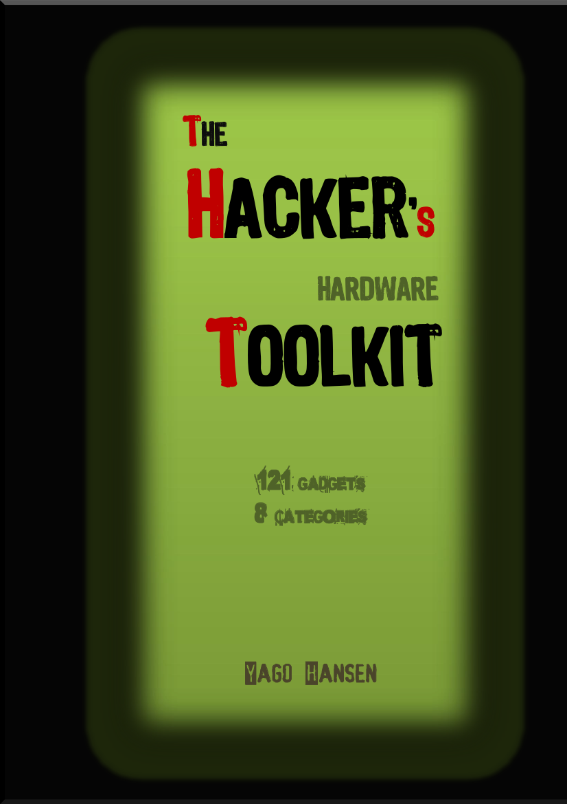

# The Hacker's Hardware Toolkit    
<h1 align="center">
 	 
    
   
</h1>

The best collection of hardware gadgets for Red Team hackers, pentesters and security researchers!
It  includes more than one hundred of tools classified in eight different categories, to make it easier to search and to browse them.

<h2>Disclaimer:</h2>

This is NOT a commercial catalog, even if it looks like that. I have no personal interest in selling any of the shown tools. I just want to share many of the tools which I have used for different hacking purposes. Any tool not available to be bought online, will be excluded from the catalog. All the tools show an approximate price and an online shop where you can buy it, since feel free to check for other better or cheaper shops in Internet. All the OCR codes include the link to an online shop which ships to Europe and of course are not malicious.

Download the catalog in [PDF](https://github.com/yadox666/The-Hackers-Hardware-Toolkit/blob/master/TheHackersHardwareToolkit.pdf) format.

**Caution**: *This catalog can cause serious problems at home with your couple. Do not abuse it! Take some minutes before clicking on the "Buy Now" button!*

## Categories
 * [Mini Computers](#mini-computers)
 * [RF](#rf-hacking)
 * [Wi-Fi](#wi-fi)
 * [RFID / NFC](#rfid-nfc)
 * [HID / Keyloggers](#hid-keylog)
 * [Network](#network)
 * [BUS](#bus-hacking)
 * [Accesories](#accesories)

### Contents
Category  |  Description
----  |  ----
[Mini Computers](https://github.com/yadox666/The-Hackers-Hardware-Toolkit/) | The best selection of handheld computers, mini motherboards, etc. The best tool to handle all the other hardware peripherals for your projects.
[RF](https://github.com/yadox666/The-Hackers-Hardware-Toolkit/) | The best tools for hacking, analyzing, modifiying or replaying any Radio Frequency signal. Tools for hacking wireless controllers, GPS, Cell phones, Satellite signals, etc.
[Wi-Fi](https://github.com/yadox666/The-Hackers-Hardware-Toolkit/) | The tookit for a Wi-Fi hacker like me. This tools allow to monitor mode sniffing, enumerating, injecting, etc. Some tools like deauther, and amplifiers should be only used in lab environments.
[RFID / NFC](https://github.com/yadox666/The-Hackers-Hardware-Toolkit/) | A nice collection of beginners and proffesional tools for researching about RFID and NFC technologies based in LF (low frequency) and HF (high frequency) contactless cards, tags and badgets. Hacking tools for access controls, garages, shops, etc.
[HID / Keyloggers](https://github.com/yadox666/The-Hackers-Hardware-Toolkit/) | HID (hardware input devices) like mouses and USB keyboards are open to a keystroke injection attack. Many of these devices like rubberducky, badusb, badusb ninja, etc. are increasing in capabilities and effectivity. Hardware keyloggers are still one of the best option for credentials capture.
[Network](https://github.com/yadox666/The-Hackers-Hardware-Toolkit/) | Small routers, taps, and other similar network devices based in Linux can be the perfect companion for an internal pentester. Here you will find many OpenWRT / LEDE based mini routers that can be customized for network intrusion.
[BUS](https://github.com/yadox666/The-Hackers-Hardware-Toolkit/) | Hardware hacking is one the most beautiful hacking categories. Since it's also one of the most complicated ones. There are many different bus technologies and protocols and a hardware hacker must own a lot of tools for discovering and 'speaking' with such buses. Some of the categories included here are: car hacking, motherboard and pcb hacking, industrial hacking, etc.
[Accesories](https://github.com/yadox666/The-Hackers-Hardware-Toolkit/) |   Not only the previous tools are enough for creating your own hacking device. If you are going to build a functional system you'll also need a lot of accesories like batteries, chargers, gps, sensors, DC-DC, lab equipment, etc.

### Contribution:
Feel free to open a bug for correcting any description, any misspelled word, or just for including your own comments. But, if any comment seems to have a commercial interest it will be immediately dismissed. I want to keep it clean from external interests. You are welcome to contribute [contributing.md](https://github.com/yadox666/The-Hackers-Hardware-Toolkit/blob/master/contributing.md#contribution-guidelines) by opening a bug. 

### To-do:
 - Add your feedback
 - Add your suggestions
 - Add an unboxing / getting started section on many items

### Need more info?

Follow me on GitHub or on your favorite social media to get daily updates on interesting security news and GitHub repositories related to Security.

 - Twitter: [@yadox](https://twitter.com/yadox)
 - Linkedin: [Yago Hansen](https://www.linkedin.com/in/yadox/)
 - Personal Web: [Yago Hansen](https://yagohansen.com/)
 
### Want to get it paperback?

I have also published this book in Amazon, because many people asked about getting a cheap paperback format. I kept the same policy to distribute it in a non-profit mode, so I kept the price as low as posible. It is available through all the Amazon international sites for many countries. If it's not available for shipping to your country, just feel free to download and print it using your own printing service. Book ISBN-10: 1099209463.

 - Amazon.com: [amazon.com](https://amzn.com/1099209463)

License
----

Mozilla Public License 2.0 

**Free for hackers, paid for commercial use!**

